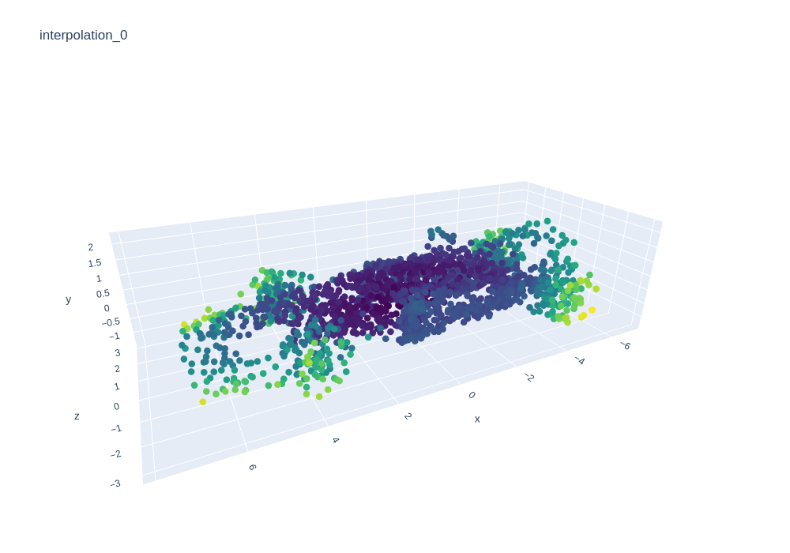
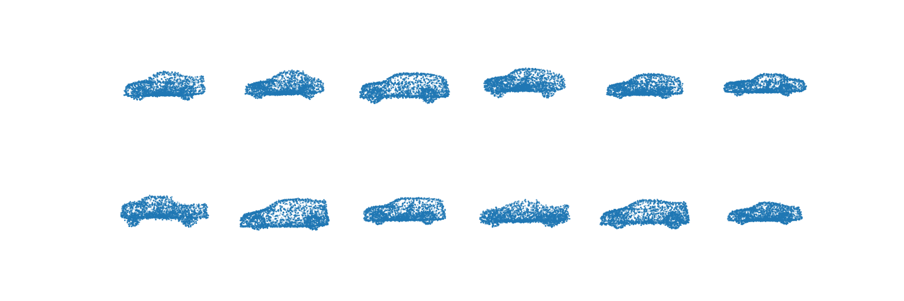
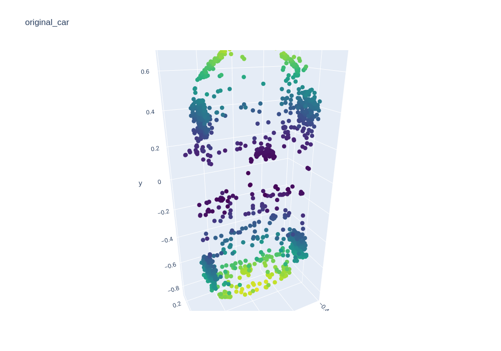
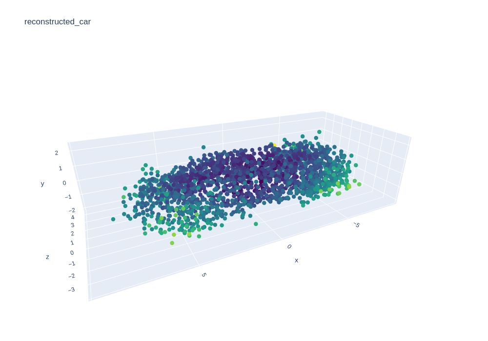

# PointNet AE and 3D Morphable Model

Morphable Model


Random Samples


Orifinal Car


Reconstructed Car


# Build environment and install required packages
## Dependency
The code has been tested on Ubuntu 20.04, PyTorch 1.9.1, PyTorch3d 0.7.0, CUDA 10.1

Use the following code to build conda environment from environment.yml
```
$ conda env create -f environment.yml
```

Used gitpath to configure repo path
```
$pip install git+https://github.com/maxnoe/python-gitpath
```